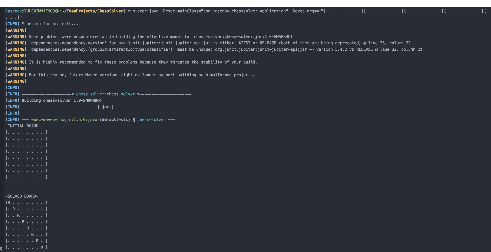
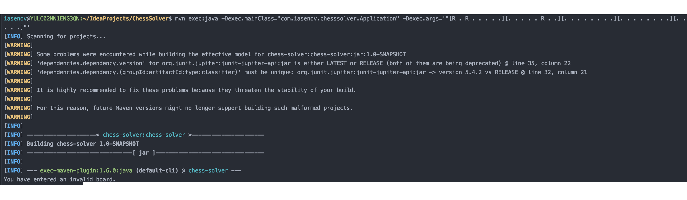

# Rook Chess Solver

Java application that uses a recursive backtracking algorithm to solve the N-Rook problem.

# Quick Start

### Running the Application
 
 First, ensure all required dependencies are installed:
 
 ```
 $ mvn clean install
 ```
 
 Then, to run the app, execute:
 
 ```
 $ mvn exec:java -Dexec.mainClass="com.iasenov.chesssolver.Application" -Dexec.args=“{BOARD}"
 ```
 Note: {BOARD} is the board as an argument. An example of board.
   ```
$ mvn exec:java -Dexec.mainClass="com.iasenov.chesssolver.Application" -Dexec.args='"[R . . . . . . .][. . . . . R . .][. . . . . . . .][. . . . . . . .][. . . R . . . .][. . . . . . . .][. R . . . . . .][. . . . . . . .]"'
 ```
To run the tests, execute: 
 ```
 $ mvn test
 ```
 
## Sample Input/Output 
### Valid empty board

### Valid populated board
 
### Invalid Input
 
 
 
## Technical 

This application is a Java based application using Maven as its build management tool.

## Contact
 * Email: ivaylo.asenov@hotmail.com
 * Phone: 514-891-2352
 
